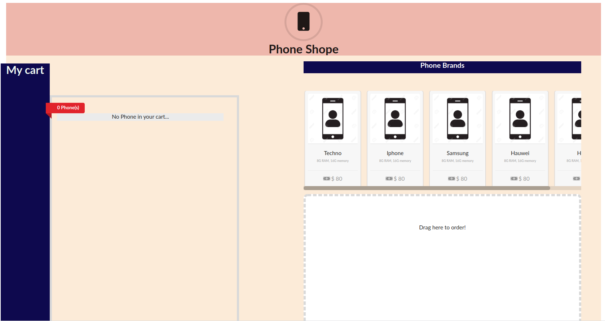

This project was bootstrapped with [Create React App](https://github.com/facebook/create-react-app).

# Shopping Cart with React, Redux and React DnD
This is a mini project that teaches you how to use React, Redux, and React DnD to build a shopping cart. In this branch, we shall:
- Code a `My Cart` section that will display phones as they are dragged and dropped in the target space.

## What the UI looks like
The UI is not that fancy. What I focus on for this part of the tutorial is the elements described above. 

Our `My Cart` section displays a placeholder message to indicate that no phone item have been added to the cart yet. Hence, we see that there is no phone in the target space

After dragging and dropping phone items into the target space, we have the following UI

*NB//* The UI is not mobile responsive.

## Available Scripts

In the project directory, you can run:

### `yarn start`

Runs the app in the development mode. 
Open [http://localhost:3000](http://localhost:3000) to view it in the browser.