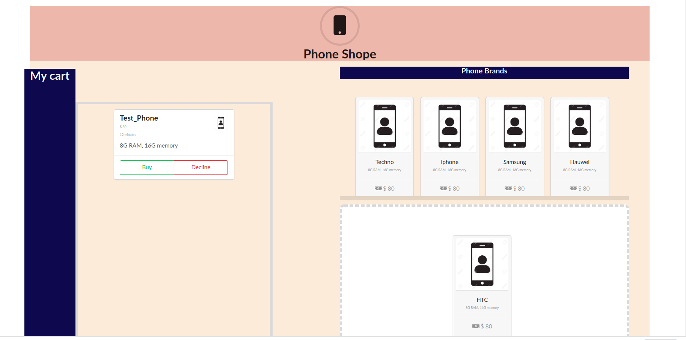
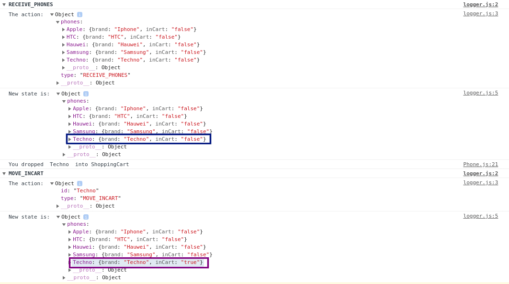

This project was bootstrapped with [Create React App](https://github.com/facebook/create-react-app).

# Shopping Cart with React, Redux and React DnD
This is a mini project that teaches you how to use React, Redux, and React DnD to build a shopping cart. In this branch, we shall learn
- [Dispatch](https://redux.js.org/api/store)
- [Actions](https://redux.js.org/basics/actions)
- [Reducers](https://redux.js.org/basics/reducers)
- [Middlewares](https://redux.js.org/advanced/middleware)

## What the UI looks like
The UI is not that fancy. What I focus on for this part of the tutorial is the elements described above. 

After dragging and dropping a phone item into the target space, we have the following UI

*NB//* The UI is not mobile responsive.

We had set our middleware `logger` to log our actions, state and new state whenever we dispatch an action. Hence we can see the console log as we drop a phone item into the target space.

We notice that When the action `RECEIVE_PHONES` is called, we have our state with `Techno` brand having `"false"` for its inCart property. But after the `MOVE_INCART` gets called(When we drag and drop and item into the target space), we see that the `Techno` brand's `inCart` property changes to `"true"`

## Available Scripts

In the project directory, you can run:

### `yarn start`

Runs the app in the development mode. 
Open [http://localhost:3000](http://localhost:3000) to view it in the browser.