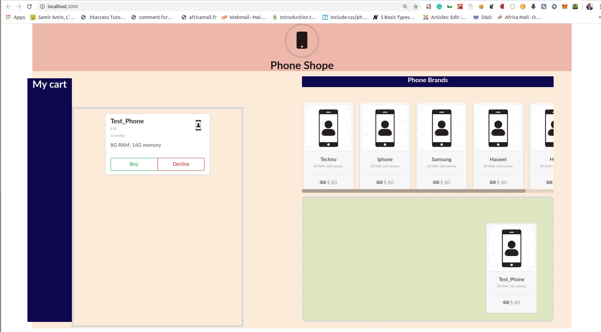

This project was bootstrapped with [Create React App](https://github.com/facebook/create-react-app).

# Shopping Cart with React, Redux and React DnD
This is a mini project that teaches you how to use React and Redux to build a shopping cart. In this branch, we shall learn
- React Components
- Redux
- [semantic ui](https://react.semantic-ui.com/)
- A bit of CSS

## What the UI looks like
The UI is not that fancy. What I focus on for this part of the tutorial is the elements described above. 
We can see our UI has the following
- The header
- A shopping list section that shows all the available phones. This is were you will drag a phone from when we most have implemented the drag and drop functionalities
- A shopping cart that will hold our dropped phones  
- A My-cart section that displays all the dropped phone information.

All of these may not serve a purpose in a real-world scenario but what I am trying to teach her is how to use React-redux and React DnD

## Available Scripts

In the project directory, you can run:

### `yarn start`

Runs the app in the development mode. 
Open [http://localhost:3000](http://localhost:3000) to view it in the browser.

