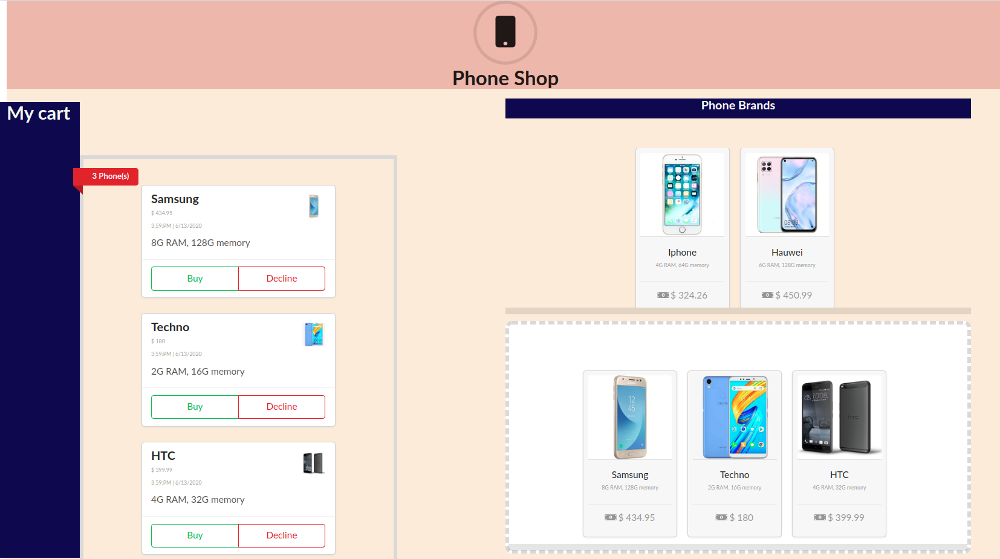
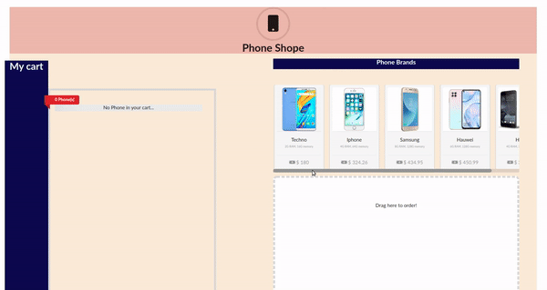

This project was bootstrapped with [Create React App](https://github.com/facebook/create-react-app).

# Shopping Cart with React, Redux and React DnD 
## Finishing touches

This is a mini project that teaches you how to use React, Redux, and React DnD to build a shopping cart. In this branch, we shall:
- replace all the placeholders and Modify the initial data to contain the right information and sort by timestamp

## What the UI looks like
The UI is not that fancy. What I focus on for this part of the tutorial is the elements described above. 

We replaced the placeholder phone image we had through out the rest of the tutorials with real images of each phone brand, then we modified the initial data with the phone details like price, RAM. We later sort items in our `My cart` section in order of the time when it was placed in the target space.

*NB//* The UI is not mobile responsive.

## Available Scripts

In the project directory, you can run:

### `yarn start`

Runs the app in the development mode. 
Open [http://localhost:3000](http://localhost:3000) to view it in the browser.