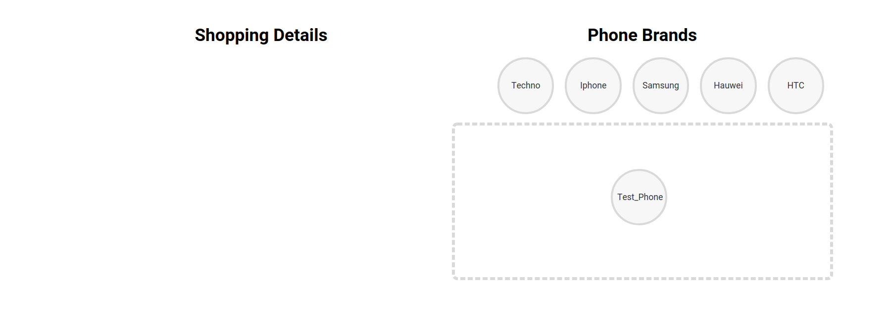

This project was bootstrapped with [Create React App](https://github.com/facebook/create-react-app).

# Shopping Cart with React, Redux and React DnD
## PART 1
This is the first part of our journey to creating a Shopping cart. This first part teaches you how to use the following 
- Structuring your react app with the `Rails-style pattern`
- React components, reducers and actions
- Redux store, connect, Provider and mapStateToProps

## How I Did It!
You can find a walkthrough of how I build this part from scratch on [my blog](https://itnext.io/build-a-shopping-cart-with-react-redux-and-react-dnd-part-1-2433558c3f38)

## Available Scripts

In the project directory, you can run:

### `yarn start`

Runs the app in the development mode. 
Open [http://localhost:3000](http://localhost:3000) to view it in the browser.

