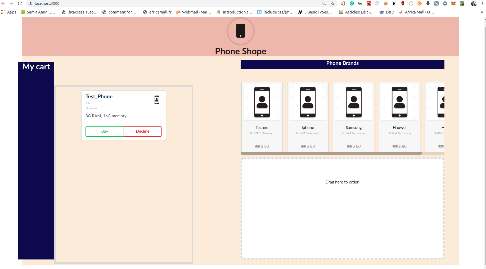
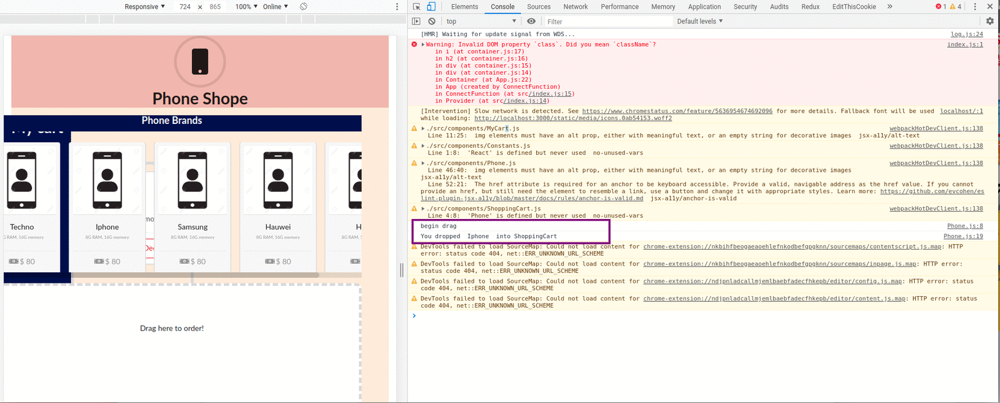

This project was bootstrapped with [Create React App](https://github.com/facebook/create-react-app).

# Shopping Cart with React, Redux and React DnD
This is a mini project that teaches you how to use React, Redux, and React DnD to build a shopping cart. In this branch, we shall learn
- [React DnD](https://react-dnd.github.io/react-dnd/about)

## What the UI looks like
The UI is not that fancy. What I focus on for this part of the tutorial is the elements described above. 

After adding the react dnd, we have the following UI

The image below shows how we can drag a phone(source) into the shopping cart(target). Whenever the source gets into the target space, there is a change in the target's background color as we see in the image below. 

We had set some console logs whenever a phone is dragged and whenever a phone gets over the target space. Hence we can see the console log as we drag and item into the target space.

*NB//* The UI is not mobile responsive.

## Available Scripts

In the project directory, you can run:

### `yarn start`

Runs the app in the development mode. 
Open [http://localhost:3000](http://localhost:3000) to view it in the browser.