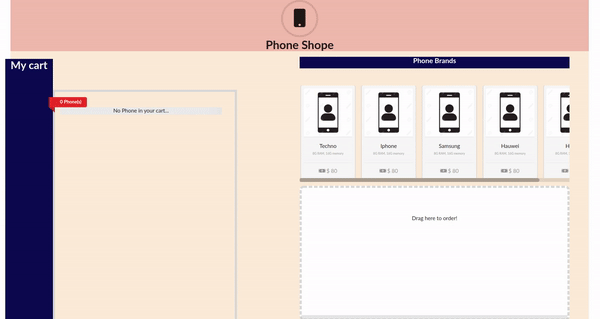

This project was bootstrapped with [Create React App](https://github.com/facebook/create-react-app).

# Shopping Cart with React, Redux and React DnD
This is a mini project that teaches you how to use React, Redux, and React DnD to build a shopping cart. In this branch, we shall:
- Use [react-transition-group](https://github.com/reactjs/react-transition-group/tree/v1-stable) to improve the feel of the app by adding transitions that will lead to better user experience. 

## What the UI looks like
The UI is not that fancy. What I focus on for this part of the tutorial is the elements described above. 

We added transitions in the various sections
- In the `My Cart` section which displays phones found in the target space
- In the `Phone Brands` section which displays all phones not added in the phone target space

*NB//* The UI is not mobile responsive.

## Available Scripts

In the project directory, you can run:

### `yarn start`

Runs the app in the development mode. 
Open [http://localhost:3000](http://localhost:3000) to view it in the browser.